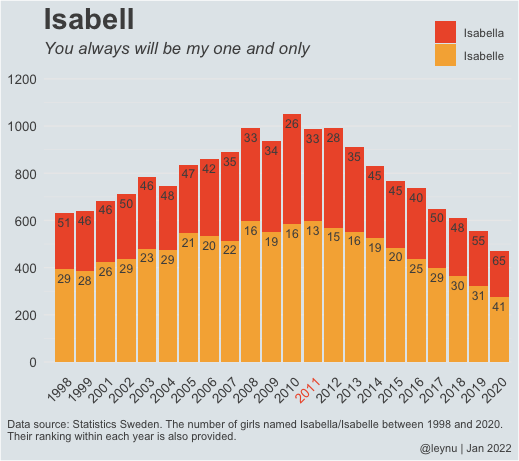
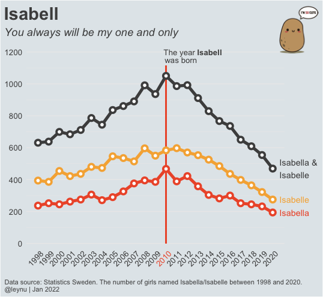

# Jan2020_Isabell

Extracted Name statistics from [SCB](https://www.scb.se/en/finding-statistics/statistics-by-subject-area/population/general-statistics/name-statistics/), Sweden and created two plots with the names Isabelle/Isabella

